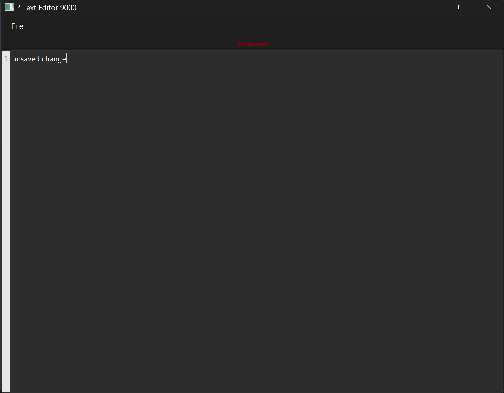
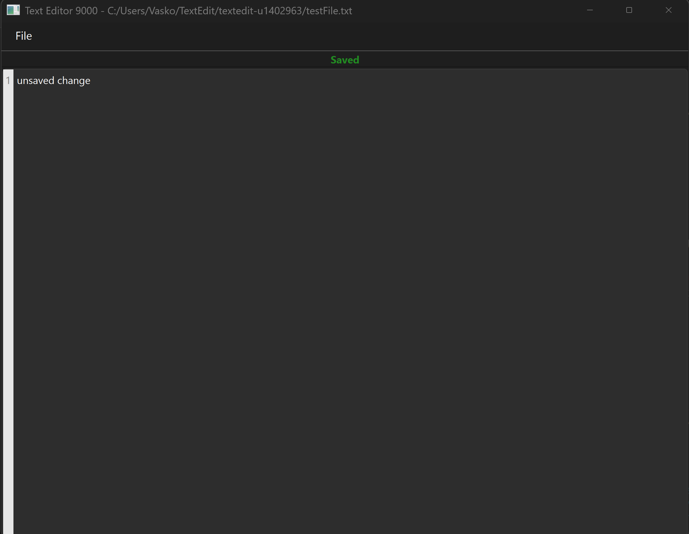
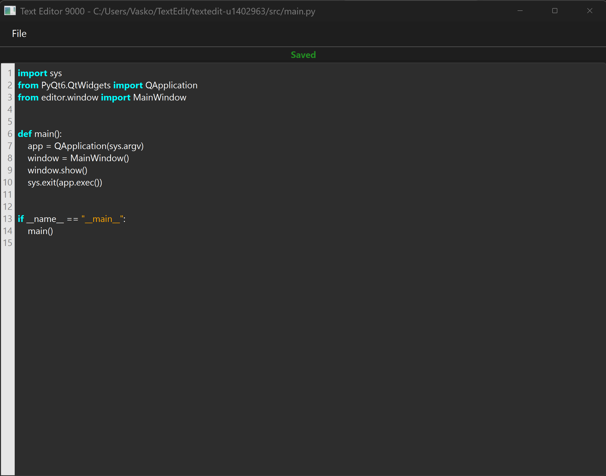

# textedit-u1402963
Text editor made using AI assistance for CS3960

# R1 - Basic Editor Foundation + Syntax Highlighting
Preface: I made a basic prototype and then got carried away adding functionality, so this is a bit long and scattered. I will do better in this regard next week.

## Feature: Basic UI & Architecture
I started off slow with a simple file structure that did not have appropriate separation of concerns, but later fixed this surprisingly easily by telling AMP to properly separate the monolithic files into proper MVC. Text editing as well as all existing UI elements work. I plan on adding a "New File" button since that was forgotten during the initial setup, as well as a help menu that describes all the shortcuts supported by the editor. 

## Feature: File Operations (Open/Save) 
The editor currently supports opening and saving text files via the native OS file picker (Ctrl+O / Ctrl+S). After messing with it for a little, I realised that it didn't show all the necessary text files in the file picker. This led me down the rabbit hole of making sure that files are highlighted appropriately based on their filetype (.py, .cpp, .md, etc). I then also handled the case where a new file was created and was not explicitly given a type by pattern matching and looking for signs of a well-known language. 


## Feature: Saved/Unsaved
This feature was surprisingly complex to implement, and I am glad that I told AMP specifically to ask me clarifying questions. I believe this saved a lot of tokens and time. The button was initially in the top right corner, and recentering it required a different layout and a QToolbar in order to fit right. When I asked AMP to ask me questions, it also guided me into telling it to add some features that I hadn't thought about or remembered that text editors needed, like asking to save the current file before opening another—all simple stuff that I have taken for granted in my own text editor use. 

 

## Feature: Syntax Highlighting & Line Numbers 
The broader vision was to be able to easily add highlighters for different languages in the future, so after I got some basic syntax highlighting working for the core languages I wanted, I reformatted the whole project in a way where each language had its own highlighter class that inherited from the base highlighter for proper separation of concerns.

I implemented a prototype for syntax highlighting using QSyntaxHighlighter with regex patterns to identify Python keywords (currently displaying in bold cyan). To improve usability, I added a dynamic line number gutter. This required creating a custom CodeEditor widget that extends the text edit area to calculate line heights and paint the numbers in a side panel. Tests in test_highlighter.py and test_code_editor.py verify that the highlighting rules apply correctly to input strings.



## Testing
There are a lot of features that I added, and a lot of testing happening beyond the "basic prototype", so I will talk about the testing of the line number margin. It gets tested by adding plaintext lines, and then measuring the width of the margin, ensuring that the numbers fit inside. 

The file IO was fairly simple to test, as most if not all of these tests manipulate the content of a file, and then see what the content is after saving/not saving, opening, etc.

The highlighter testing first goes through the main case where the file has a filetype and that determines which highlighter will be used for it. The tests that examine the pattern matching follow, where a simple Python file for example is fed into the language detector and we verify that the correct language is matched based on this. There are also tests that validate that the detected syntax is actually highlighted.


## AI Generated content below

**Project Structure:**
```
src/
├── main.py              # Application entry point
└── editor/
    ├── window.py        # MainWindow (UI layer)
    ├── code_editor.py   # CodeEditor with line numbers
    ├── highlighter.py   # PythonHighlighter (syntax highlighting)
    └── file_manager.py  # FileManager (I/O logic)
tests/
├── test_code_editor.py  # Line number tests
├── test_editor_io.py    # File I/O tests
└── test_highlighter.py  # Syntax highlighting tests
```

# R2 - 

## Monday notes -
Added new file button, simple, quick
Worked on undo/redo functionality. Undo would delete everything, and redo would bring it all back, not very useful. I asked AMP to research how undo/redo works in traditional text editors and to formulate an update accordingly. First I made it write tests that validate the expected behavior, and then write the patch for undo/redo. I noticed that in its implementation it did not do any form of "garbage collection" if you will for the events that undo/redo use. I know this will be an issue in the future so I prompted it to only keep 100 recent revisions to be eligible for undo/redo.