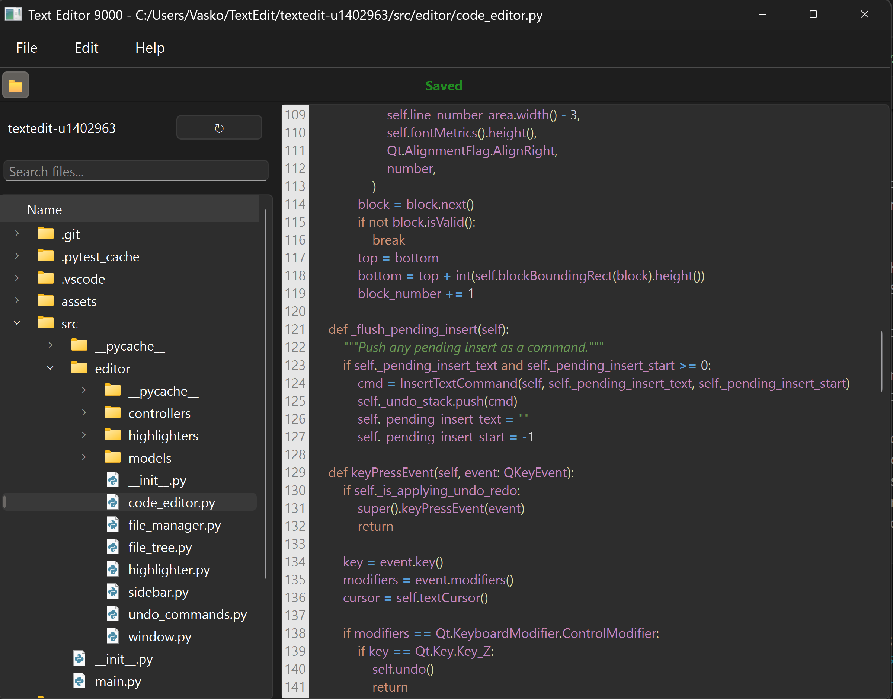
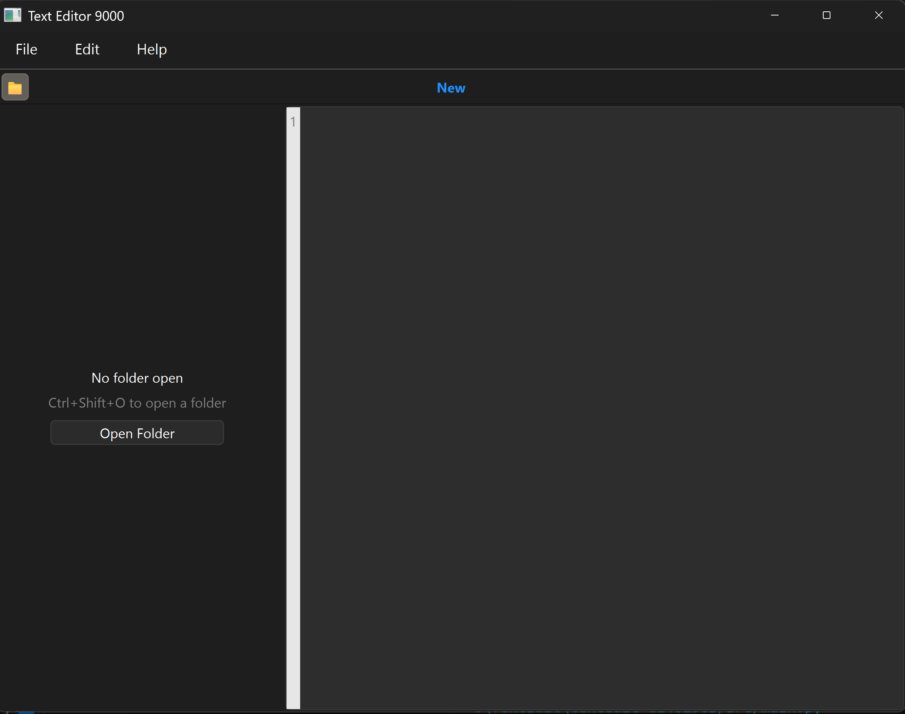
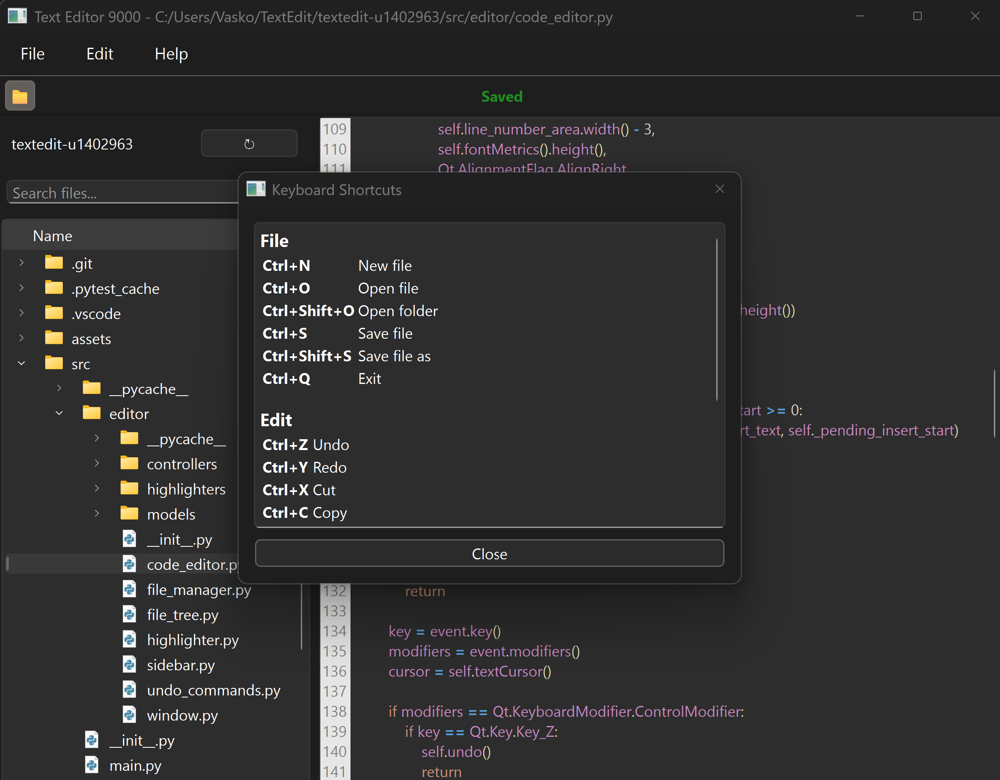

# textedit-u1402963
Text editor made using AI assistance for CS3960

# R1 - Basic Editor Foundation + Syntax Highlighting
Preface: I made a basic prototype and then got carried away adding functionality, so this is a bit long and scattered. I will do better in this regard next week.

## Feature: Basic UI & Architecture
I started off slow with a simple file structure that did not have appropriate separation of concerns, but later fixed this surprisingly easily by telling AMP to properly separate the monolithic files into proper MVC. Text editing as well as all existing UI elements work. I plan on adding a "New File" button since that was forgotten during the initial setup, as well as a help menu that describes all the shortcuts supported by the editor. 

## Feature: File Operations (Open/Save) 
The editor currently supports opening and saving text files via the native OS file picker (Ctrl+O / Ctrl+S). After messing with it for a little, I realised that the file picker wasn't filtering correctly to show all text files. This led me down the rabbit hole of making sure that files are highlighted appropriately based on their filetype (.py, .cpp, .md, etc). I then also handled the case where a new file was created and was not explicitly given a type by pattern matching and looking for signs of a well-known language. 


## Feature: Saved/Unsaved
This feature was surprisingly complex to implement, and I am glad that I told AMP specifically to ask me clarifying questions. I believe this saved a lot of tokens and time. The button was initially in the top right corner, and recentering it required a different layout and a QToolbar in order to fit right. When I asked AMP to ask me questions, it also guided me into telling it to add some features that I hadn't thought about or remembered that text editors needed, like asking to save the current file before opening another—all simple stuff that I have taken for granted in my own text editor use. 

 

## Feature: Syntax Highlighting & Line Numbers 
The broader vision was to be able to easily add highlighters for different languages in the future, so after I got some basic syntax highlighting working for the core languages I wanted, I reformatted the whole project in a way where each language had its own highlighter class that inherited from the base highlighter for proper separation of concerns.

I implemented a prototype for syntax highlighting using QSyntaxHighlighter with regex patterns to identify Python keywords (currently displaying in bold cyan). To improve usability, I added a dynamic line number gutter. This required creating a custom CodeEditor widget that extends the text edit area to calculate line heights and paint the numbers in a side panel. Tests in test_highlighter.py and test_code_editor.py verify that the highlighting rules apply correctly to input strings.


## Testing
There are a lot of features that I added, and a lot of testing happening beyond the "basic prototype", so I will talk about the testing of the line number margin. It gets tested by adding plaintext lines, and then measuring the width of the margin, ensuring that the numbers fit inside. 

The file IO was fairly simple to test, as most if not all of these tests manipulate the content of a file, and then see what the content is after saving/not saving, opening, etc.

The highlighter testing first goes through the main case where the file has a filetype and that determines which highlighter will be used for it. The tests that examine the pattern matching follow, where a simple Python file for example is fed into the language detector and we verify that the correct language is matched based on this. There are also tests that validate that the detected syntax is actually highlighted.


## AI Generated content below

**Project Structure:**
```
src/
├── main.py              # Application entry point
└── editor/
    ├── window.py        # MainWindow (UI layer)
    ├── code_editor.py   # CodeEditor with line numbers
    ├── highlighter.py   # PythonHighlighter (syntax highlighting)
    └── file_manager.py  # FileManager (I/O logic)
tests/
├── test_code_editor.py  # Line number tests
├── test_editor_io.py    # File I/O tests
└── test_highlighter.py  # Syntax highlighting tests
```

# R2

## General Overview
Added new file button, simple, quick. Worked on undo/redo functionality and implemented a file tree explorer.

# Undo/Redo
Initially, undo would delete everything and redo would bring it all back — not very useful. I asked AMP to research how undo/redo works in traditional text editors and to formulate an update accordingly. First I made AMP write tests that validate the expected behavior, and then write the patch for undo/redo. I noticed that in its implementation it did not do any form of "garbage collection" for the events that undo/redo use. I knew this would be an issue in the future so I prompted it to only keep 100 recent revisions to be eligible for undo/redo.

This feature works completely. After the lecture where we talked about testing, I tried some of the edge cases and found that none of them really impacted my undo/redo at least. The technique I used for making my life easier on this one was telling AMP to ask clarifying questions before implementing and this had absolutely awesome results. I found that there is so much left up to the LLM to decide implicitly, and this strategy reveals that to the developer and gives them back control. I essentially kept telling AMP what was not working, made it write a test before fixing anything, and then verifying the fix by the now passing test(s). I asked AMP to write tests for this one, to be honest I'm not sure what exactly it is they do, but every time I made it fix something that was wrong with undo/redo I would make it write a test for the issue, confirm it failed, and then make a fix for the problem, and then the test would pass, so I'm fairly sure the tests are actually doing something at least. Another thing I fought with briefly is that operations like cut and paste did not behave as expected, but with my approach of writing a test, and then fixing the code AMP had absolutely no issues giving me what I wanted.

# File tree explorer
This feature works well, after I did the first implementation there were some funny little issues, but after a couple prompts I got them ironed out. I decided to make the app not show a default folder, like VS Code and make the user select one, but this was also a way to bypass some weird behavior of navigating the filesystem through the file tree widget where it wouldn't show any files. With the current implementation I think everything makes sense and works as expected. For this I also made AMP generate tests, consider edge cases, etc. and made it write tests before fixing issues, but most of my testing was by using the editor and seeing when it misbehaved since I didn't want to add a bunch of GUI tests. If I get a chance though, I will add some of those next week. For now the button to hide the sidebar with the file explorer is under a button called "View" in the top row, but that is not my favorite. I will relocate it to a dedicated button within the sidebar so it's more intuitive. This was one of those small things that I didn't describe clearly enough, so AMP just did whatever it wanted. Issues like this were mitigated extremely well by asking AMP to ask you lots of clarifying questions since it made the implicitly decided behavior much more direct.

Initial launch screen:


When a folder is selected:


# R3
Improved syntax highlighting, cleaned up many bugs, and added some polish.

# Real syntax highlighting
I overhauled syntax highlighting to be more accurate and function like a real system rather than just a dumb regex-based system. I did some research on how real syntax highlighting works, wrote a detailed prompt of what I wanted AMP to create, and told it to ask me follow up uqestions to give me a say in every choice and design decision that it makes implicitly. After a couple thousand lines of code, and some manual testing the syntax highlighting looks much better, and works in a way that is much closer to real deal highlighters. The current design is much more extensible and has the capability to be built into a truly advanced system. 

The way this works is kind fo like a lexer, since it maintains state and knows if its in a comment or a <script></script> tag which changes the "mode" its in, very similar to the first pass of a compiler.

This feature was just an edit of the previous version of syntax highlighting, albeit a drastic one. AS far as testing, I made AMP generate tests that essentially set the state of the highlighter, and then verify that it attempts to highlight the code correctly. I also did a decent amount of manual testing which revealed some issues that AMP fixed.

# File Tree Explorer
The file tree explorer was more challenging to describe and figure out what features I wanted than to implement. Something that helped a lot was telling amp to not make any implicit choices, and instead ask me what behavior I want for each feature. This helped me waste less tokens on AMP making stuff that I don't want or doesn't work as well. At this point I would say that the file explorer works about as well as any, with the exception of the ability to leave the root folder without opening the OS's file explorer, definitely clunky. I'm very happy that I got the right click features working, and that the search bar was such an easy implementation.



A lot of the work in R3 was on polish and ensuring that the editor behaved as expected. I spent some time making things like adding a file from the built in file explorer works as expected, as well as a search feature that allows the user to find files within the integrated explorer quickly. This feature was born when I was trying to test some functionality in my downloads folder and couldn't find the test file that I had saved. The feature was simple and low code, but drastically improved the experiance of using the editor. I also added a button to hide/reopen the file explorer, changed the status indicator to show "New" when a empty new file has not been saved. 



