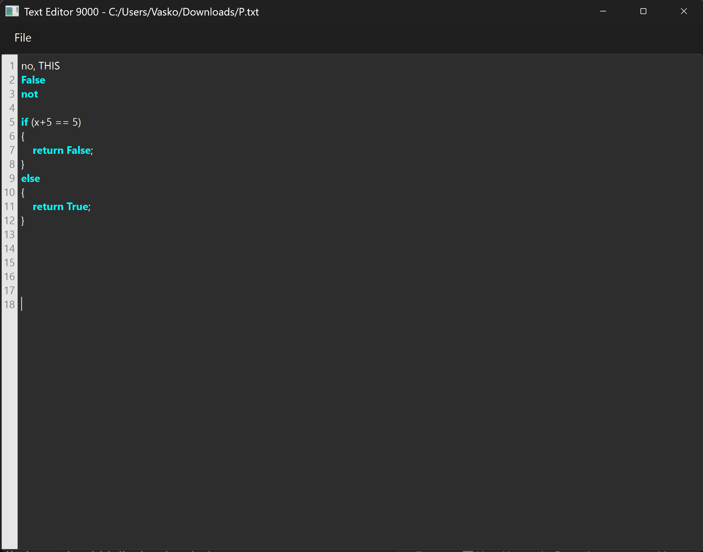

# textedit-u1402963
Text editor made using AI assistance for CS3960


# R1 - Basic Editor Foundation

## Feature: Basic UI & Architecture
 I established the core architecture using QPlainTextEdit rather than QTextEdit to ensure better performance with large files. The application follows a modular MVC design, separating the MainWindow (UI) from the FileManager (logic). This separation allowed me to implement unit testing without heavy Qt dependencies. I verified this structure using pytest with 32 tests covering the editor I/O and window initialization.

## Feature: File Operations (Open/Save) 
The editor currently supports opening and saving text files via the native OS file picker (Ctrl+O / Ctrl+S). While it currently defaults to .txt files, the underlying FileManager class is designed to handle various extensions. I validated this feature by writing tests in test_editor_io.py that simulate file streams to ensure data integrity during save operations.


## Feature: Syntax Highlighting & Line Numbers 
I implemented a prototype for syntax highlighting using QSyntaxHighlighter with regex patterns to identify Python keywords (currently displaying in bold cyan). To improve usability, I added a dynamic line number gutter. This required creating a custom CodeEditor widget that extends the text edit area to calculate line heights and paint the numbers in a side panel. Tests in test_highlighter.py and test_code_editor.py verify that the highlighting rules apply correctly to input strings.



## What's Next (R2) 
Currently, tab scaling is not optimized, and syntax highlighting is limited to Python. In R2, I plan to implement find and replace, allow the editor to open python files, Automatic indentation and bracket and quote matching, A file tree explorer with collapsible folders, as well as potentially going further to add more of the extra features and refinning the current UI.

## AI Generated content below

**Project Structure:**
```
src/
├── main.py              # Application entry point
└── editor/
    ├── window.py        # MainWindow (UI layer)
    ├── code_editor.py   # CodeEditor with line numbers
    ├── highlighter.py   # PythonHighlighter (syntax highlighting)
    └── file_manager.py  # FileManager (I/O logic)
tests/
├── test_code_editor.py  # Line number tests
├── test_editor_io.py    # File I/O tests
└── test_highlighter.py  # Syntax highlighting tests
```

**Design Decisions:**
- **QPlainTextEdit**: Chosen over QTextEdit for better performance with large plain-text files and code. It uses a simpler document model optimized for plain text without rich formatting overhead.
- **CodeEditor**: Custom widget extending QPlainTextEdit with a LineNumberArea widget for displaying line numbers.
- **PythonHighlighter**: Uses QSyntaxHighlighter with regex patterns to highlight Python keywords.
- **Separated I/O Logic**: `FileManager` class isolates file operations from GUI code, enabling unit testing without Qt dependencies.
- **Modular Architecture**: UI and logic separation following MVC principles for maintainability.

### Testing
Validated using **pytest** (32 tests). Run tests with:
```
set PYTHONPATH=src && python -m pytest tests/ -v
```

R2:


R3:
